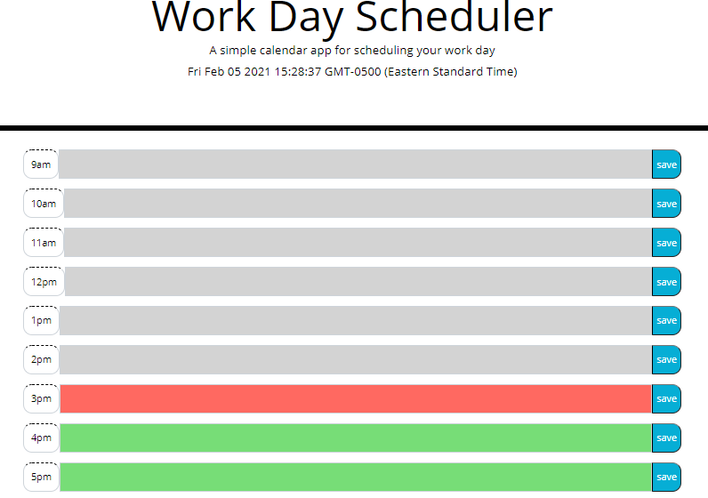

# Work Day Scheduler

* [Git Hub Repository](https://github.com/malhill/Daily-Calender "Weather App Repository")
* [Live Weather App](https://malhill.github.io/Daily-Calender/ "Live App")

## HTML:

Added classes, button icons, and values to the div.

`Update`:
* Changed hours to military time. 

## CSS: 

Left alone, but utilized the classes for JS.

## JS:

Worked on utilizing jquery and js together. Attempted to create a function that would save the text value, and recall it using JSON. The difficulty was in keeping track of all the classes and where to properly place them. 

* Came across a JQuery issue that took up a lot of time. Wasnt sure whether to turn $ into functions but it prevented me from logging my values beyond the point. Stack Overflow did not seem to resolve the issue either. 

`Update`: 
* Learned that the Jquery CDN needed to be at the top of the scripts!
* Worked on keycode number 13 for entering in the input field as well as clicking the save button.